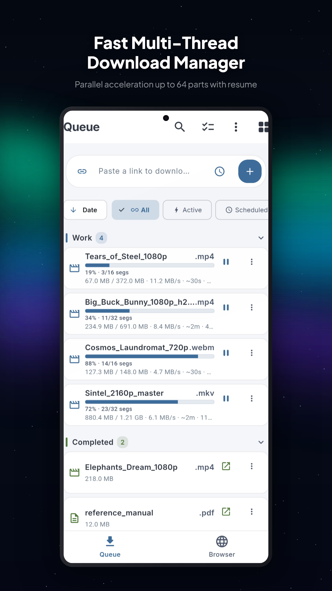
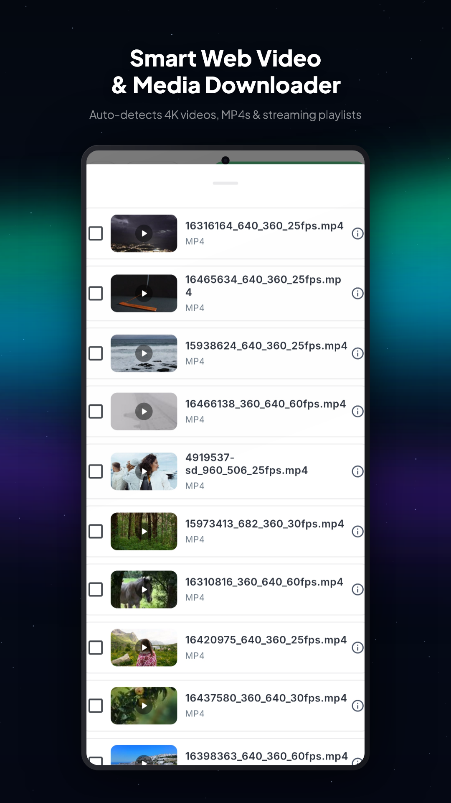
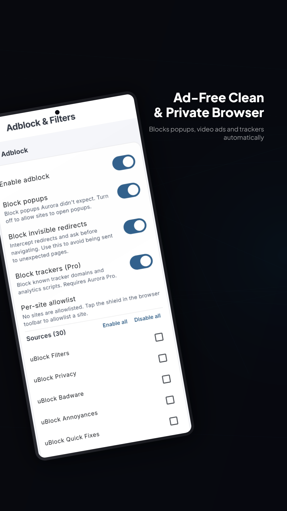
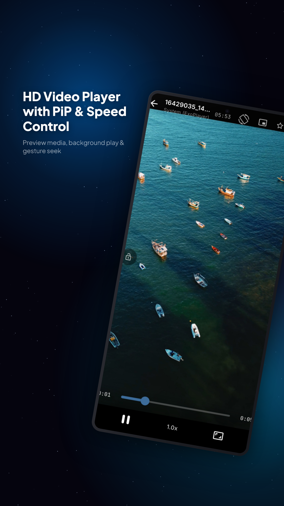
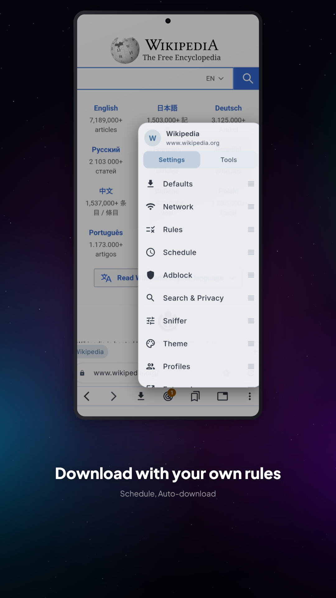
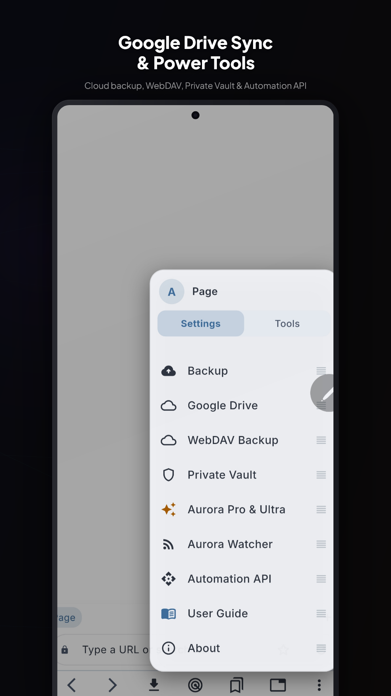
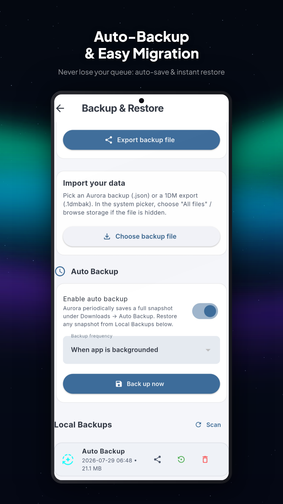

# Aurora Download Manager

[](LICENSE)
[](https://developer.android.com)
[](https://flutter.dev)

**Aurora Download Manager solves the friction of capturing and downloading media on Android.** It seamlessly transforms web browsing into background media capture with an integrated network sniffer, multi-threaded segmented HTTP engine, native HLS/DASH remuxing, and BitTorrent support — all wrapped in a sleek Nordic Glass UI.

> **Open-source edition**: this repository is the fully unlocked open-source build — every Pro & Ultra feature is enabled by default, with **no proprietary components** (no Play Billing, no Google Play Services, no license server). It is built and distributed from source for GitHub Releases / F-Droid / sideload. The freemium listing with one-time in-app purchases is distributed separately on the Google Play Store.

---

## Quick Start (One Command)

Test, analyze, and spin up Aurora Download Manager on your Android device or emulator with a single command:

```bash
git clone https://github.com/52191314/Aurora_Download_Manager.git && cd Aurora_Download_Manager && flutter pub get && flutter test && flutter run
```

---

## Screenshots

<p align="center">
  
  
  
  
  
  
  
</p>

---

## Key Features

| Feature | Description |
|---------|-------------|
| **Segmented HTTP Downloads** | Multi-threaded range requests, speed limiter, auto-retry, stall detection, auto-classification, and SHA-256 verification. |
| **HLS & DASH Streaming** | Master/media playlist parsing, representation extraction, AES-128 decryption, fMP4/TS segment validation, and native `MediaMuxer` TS→MP4 remuxing. |
| **Native BitTorrent** | BitTorrent and magnet link intake powered by high-performance native `libtorrent` bindings. |
| **In-App Browser & Sniffer** | Multi-tab support, Samsung-style tab groups, User-Agent switcher, element picker adblock rules, cosmetic block engine, and capture tray. |
| **Real-World CDN Survival** | Retains session cookies, Referer, custom User-Agents, and WebView-bound fetch routines for WAF/Cloudflare-protected hosts. |
| **Hybrid Adblock** | Native C++ adblock engine (`libaurora_adblock.so`: domain trie + Aho-Corasick) with Dart fallback. |
| **In-App Player** | Custom video player with full-screen controls, aspect-ratio toggles, speed controls, and automatic header/cookie passthrough. |

---

## Build & Distribution

This repository ships the open-source (`github`) build channel.

```bash
# Debug build (fat APK, everything included)
flutter build apk --debug

# Release APK (signs with the debug keystore when android/key.properties is
# absent — F-Droid re-signs with its own key when building from source)
flutter build apk --release
```

Verify the build stays proprietary-free:

```bash
unzip -l build/app/outputs/flutter-apk/app-debug.apk \
  | grep -iE "play-services|billing|feature-delivery|play-core"   # must be empty
```

---

## Donate

Aurora Download Manager is free and open source. If you would like to support
development:

- **Patreon**: https://www.patreon.com/c/Ahjie521
- **USDT (BEP20 / BSC)**: `0xd08d47bde441888166b801616754c667672cd502`

---

## Requirements & License

- **Flutter SDK**: Dart `^3.8.1`
- **Android SDK**: Min API **24**, Compile API **36**, NDK **27.0.12077973**
- **License**: [GNU General Public License v3.0](LICENSE)

*Disclaimer: Aurora Download Manager is a general-purpose download and browsing tool. Users are responsible for complying with applicable laws and site terms of service.*
