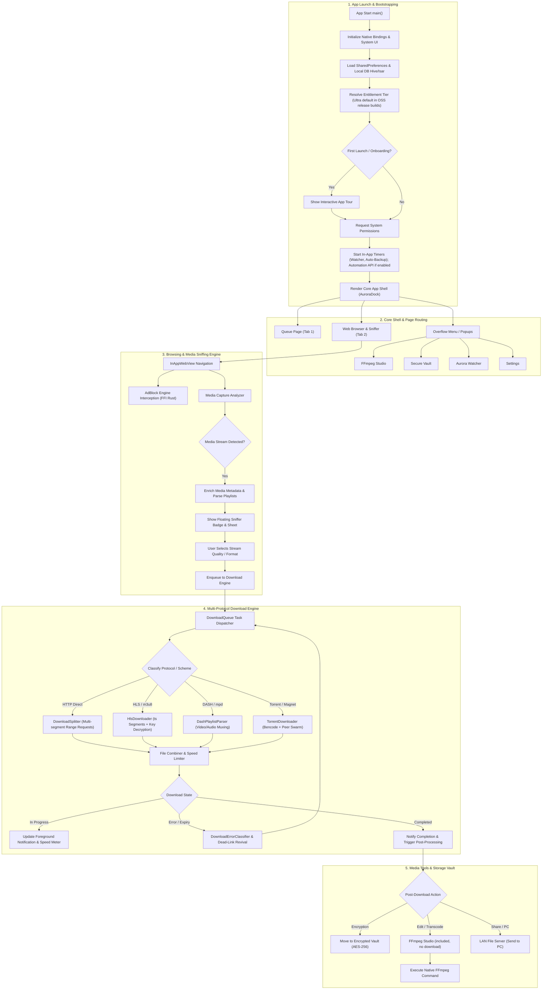
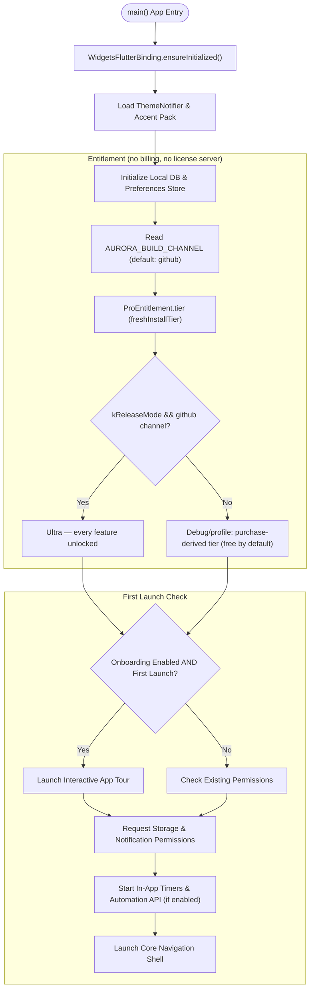
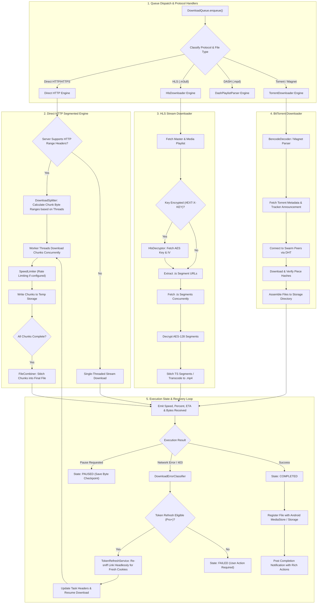

# Aurora Download Manager

[](https://github.com/52191314/Aurora_Download_Manager/actions/workflows/ci.yml)
[](LICENSE)
[](https://developer.android.com)
[](https://flutter.dev)

**Aurora Download Manager solves the friction of capturing and downloading media on Android.** It seamlessly transforms web browsing into background media capture with an integrated network sniffer, multi-threaded segmented HTTP engine, native HLS/DASH remuxing, and BitTorrent support — all wrapped in a sleek Nordic Glass UI.

> ℹ️ **Open-source edition**: this repository is the fully unlocked open-source build — every Pro & Ultra feature is enabled by default, with **no proprietary components** (no Play Billing, no Google Play Services, no license server). It is built and distributed from source for GitHub Releases / F-Droid / sideload. The freemium listing with one-time in-app purchases is distributed separately on the Google Play Store.

---

## ⚡ Quick Start (One Command)

Test, analyze, and spin up Aurora Download Manager on your Android device or emulator with a single command:

```bash
git clone https://github.com/52191314/Aurora_Download_Manager.git && cd Aurora_Download_Manager && flutter pub get && flutter test && flutter run
```

---

## 🏗️ Architecture & Workflows

Aurora Download Manager decouples media detection from downloading, running background isolation workers to prevent UI main-thread jank and handling complex protocols seamlessly.

### Master Application Workflow



<details>
<summary><b>🔍 View Detailed Subsystem Diagrams (Bootstrapping, Sniffer, Multi-Protocol Engine, FFmpeg Studio & Vault)</b></summary>

#### Bootstrapping & Entitlement (OSS edition)


#### Multi-Protocol Download Engine Lifecycle


</details>

---

## ✨ Why Aurora Download Manager?

- **Catch Media While Browsing** — Automatically hook DOM, `fetch`/`XHR`, media elements, and resource streams without manual copy-pasting.
- **Survive Real-World CDNs** — Retains session cookies, Referer, custom User-Agents, and WebView-bound fetch routines for WAF/Cloudflare-protected hosts.
- **Finish the Job Reliably** — Pause/resume, multi-chunk HTTP, HLS segment fetching + AES-128 decryption, TS→MP4 remuxing, foreground service protection, and auto-categorization.
- **Modern Nordic UI** — Samsung-style browser chrome, tab groups, customizable capture tray, and dark/light Nordic Glass themes.
- **Fully Unlocked** — The open-source build ships every Pro & Ultra feature (FFmpeg Studio, Watcher, Automation API, Encrypted Vault, E2EE vault sync) with nothing to buy.

---

## 🚀 Key Features

| Feature | Description |
|---------|-------------|
| 📥 **Segmented HTTP Downloads** | Multi-threaded range requests, speed limiter, auto-retry, stall detection, auto-classification, and SHA-256 verification. |
| 🎬 **HLS & DASH Streaming** | Master/media playlist parsing, representation extraction, AES-128 decryption, fMP4/TS segment validation, and native `MediaMuxer` TS→MP4 remuxing. |
| 🧲 **Native BitTorrent** | BitTorrent and magnet link intake powered by high-performance native `libtorrent` bindings. |
| 🌐 **In-App Browser & Sniffer** | Multi-tab support, Samsung-style tab groups, User-Agent switcher, element picker adblock rules, cosmetic block engine, and capture tray. |
| 🛡️ **Hybrid Adblock** | Native C++ adblock engine (`libaurora_adblock.so`: domain trie + Aho-Corasick) with Dart fallback. |
| 🎥 **In-App Player** | Custom video player with full-screen controls, aspect-ratio toggles, speed controls, and automatic header/cookie passthrough. |

---

## 🔓 Open-Source Integrity

This edition is deliberately kept free of proprietary components so it can be built and audited end-to-end:

- **No Play Billing** — no `in_app_purchase`, no billing client, no purchase paths.
- **No Google Play Services** — no `play-services-*`, no Firebase, no analytics/tracking SDKs.
- **No license server** — the Play edition's server-verified entitlement system is absent; nothing phones home.
- **No Play Feature Delivery** — no on-demand modules, no SplitCompat/SplitInstall; FFmpeg and all native engines ship inside the APK.
- **All Pro & Ultra features unlocked** in release builds (see `ProEntitlement.freshInstallTier`).
- Runtime plugin registration (`aurora_downloader/feature_delivery` → `registerPlugin`) is kept so the forked FFmpeg/media-kit plugins load on fat builds.

---

## 📦 Build & Distribution

This repository ships the open-source (`github`) build channel. The `play` channel define exists in code only for fork compatibility — its proprietary dependencies were removed here, so a Play-channel build is **not** supported from this repo.

```bash
# Debug build (fat APK, everything included)
flutter build apk --debug

# Release APK (signs with the debug keystore when android/key.properties is
# absent — F-Droid re-signs with its own key when building from source)
flutter build apk --release
```

Verify the build stays proprietary-free:

```bash
unzip -l build/app/outputs/flutter-apk/app-debug.apk \
  | grep -iE "play-services|billing|feature-delivery|play-core"   # must be empty
```

---

## 🌟 Awesome Ecosystem & Community

Aurora Download Manager is designed for developers and open-source enthusiasts. It fits into curated developer indices:

- 💙 **[Awesome Flutter](https://github.com/Solido/awesome-flutter)** — Open-source production Flutter applications.
- 🤖 **[Awesome Android](https://github.com/JStumpp/awesome-android)** — Top open-source Android utilities and download managers.
- 🔓 **[Awesome Open Source Apps](https://github.com/serhii-londar/open-source-mac-os-apps)** — Privacy-respecting mobile tools.

Have a feedback idea or feature request? Join our community discussions on [GitHub Discussions](https://github.com/52191314/Aurora_Download_Manager/discussions) or submit issues via the [Issue Tracker](https://github.com/52191314/Aurora_Download_Manager/issues).

---

## 🤝 Open for Contributions

We love contributions! Check out our detailed **[CONTRIBUTING.md](CONTRIBUTING.md)** guide to get started.

- 🐛 **[Good First Issues](https://github.com/52191314/Aurora_Download_Manager/issues?q=is%3Aissue+is%3Aopen+label%3A%22good+first+issue%22)** — Perfect for newcomers looking for quick, high-impact fixes.
- 💡 **[Help Wanted](https://github.com/52191314/Aurora_Download_Manager/issues?q=is%3Aissue+is%3Aopen+label%3A%22help+wanted%22)** — Feature requests and sniffer enhancements seeking community pull requests.

---

## 📜 Requirements & License

- **Flutter SDK**: Dart `^3.8.1`
- **Android SDK**: Min API **24**, Compile API **36**, NDK **27.0.12077973**
- **License**: [GNU General Public License v3.0](LICENSE)

*Disclaimer: Aurora Download Manager is a general-purpose download and browsing tool. Users are responsible for complying with applicable laws and site terms of service.*
